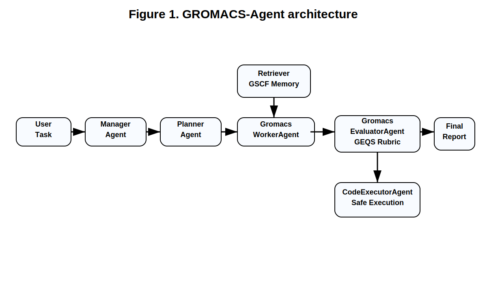
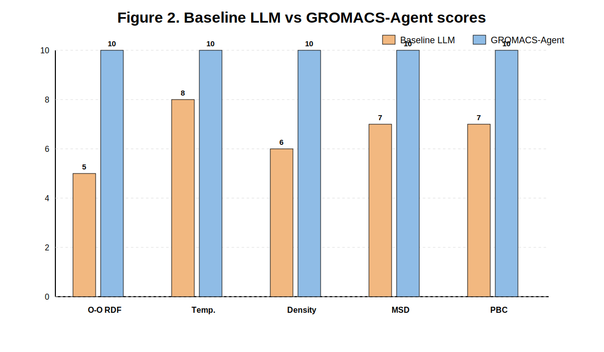
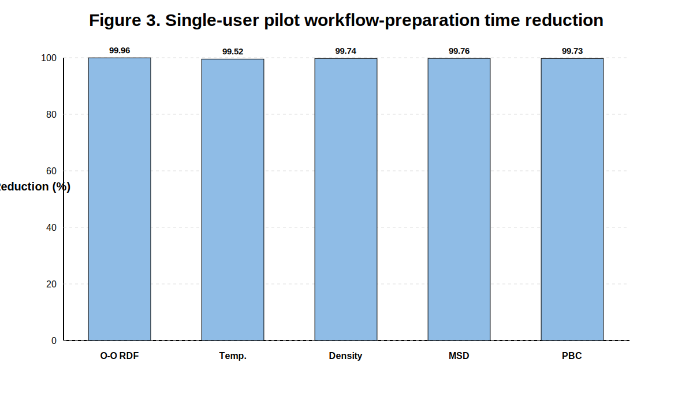
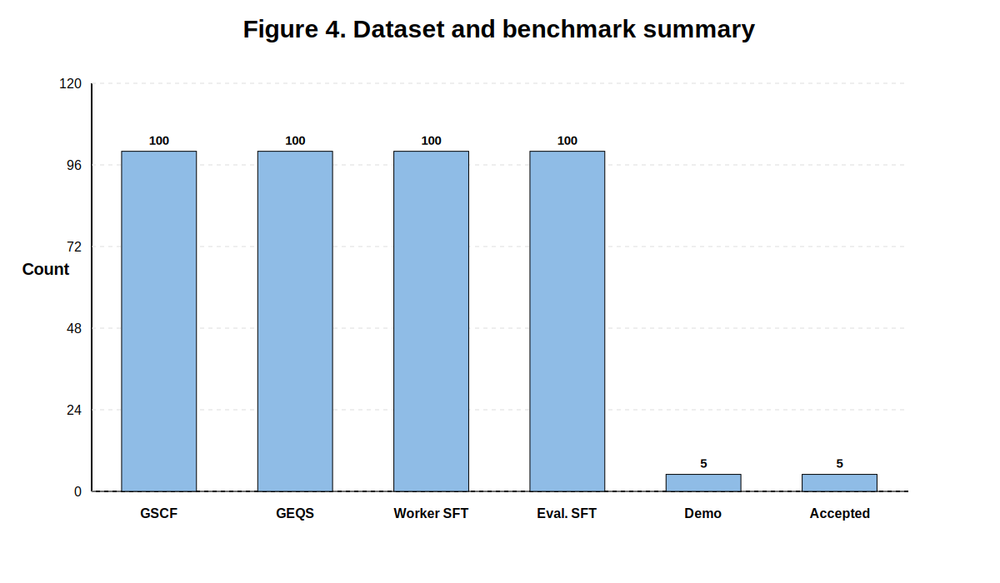

# GROMACS-Agent: An MDAgent-style multi-agent framework for automated GROMACS workflow generation, evaluation, correction, and selected execution

## Abstract

Large language models can assist molecular dynamics simulation setup, but direct generation of GROMACS workflows remains challenging because GROMACS requires coordinated handling of topology files, MDP settings, run-input files, trajectories, energy files, and post-processing commands. Here we present GROMACS-Agent, a model-agnostic, MDAgent-style multi-agent framework for topology-aware GROMACS workflow generation, evaluation, correction, and selected safe execution. The framework combines ManagerAgent, PlannerAgent, Retriever, GromacsWorkerAgent, GromacsEvaluatorAgent, and CodeExecutorAgent. A curated benchmark dataset was constructed with 100 GROMACS Script Construction for Fine-tuning records and 100 GROMACS Expert Quality Scoring records. Five representative GROMACS tasks were evaluated, including O-O RDF calculation, temperature time-series extraction, density calculation, MSD/diffusion analysis, and PBC trajectory preprocessing. GROMACS-Agent achieved evaluator scores of 10/10 for all five tasks, while baseline LLM responses achieved an average score of 6.6/10. The average evaluator-score improvement was +3.4 points. CodeExecutorAgent further demonstrated selected safe execution for validated analysis tasks.

## Introduction

Molecular dynamics simulation workflows require careful coordination of system preparation, topology files, parameter settings, trajectory processing, and physical validation. Although general-purpose large language models can generate useful suggestions, they often produce incomplete or unsafe simulation workflows, especially when task-specific file dependencies and software conventions are required. GROMACS is particularly challenging because a valid workflow depends on consistent use of coordinate files, topology files, MDP files, TPR files, trajectory files, energy files, and post-processing commands.

This study introduces GROMACS-Agent, a multi-agent framework designed to improve GROMACS workflow generation and evaluation. The system follows an MDAgent-style architecture but is adapted to GROMACS-specific requirements, including topology checking, MDP preparation, command sequence validation, analysis command selection, and selected safe execution.

## Text-to-workflow generation and agent design

GROMACS-Agent follows an MDAgent-style text-to-workflow generation strategy. A natural-language molecular dynamics request is first interpreted by a ManagerAgent and decomposed by a PlannerAgent into required simulation and analysis steps. The Retriever identifies related examples from the GSCF dataset, and the GromacsWorkerAgent generates a topology-aware GROMACS workflow including required input files, MDP/topology/TPR dependencies, GROMACS command sequences, post-processing commands, expected outputs, and validation notes.

The GromacsEvaluatorAgent then evaluates the generated workflow using the GEQS scoring rubric, identifies syntax, sequence, parameter, analysis, and reproducibility errors, and provides correction suggestions. For selected safe tasks, the CodeExecutorAgent can execute allow-listed GROMACS commands and generate an execution report.

Therefore, the framework extends text-to-code molecular dynamics agent concepts into a GROMACS-specific text-to-workflow, evaluation, correction, and safe-execution pipeline.

## Methods

### Multi-agent architecture

GROMACS-Agent consists of ManagerAgent, PlannerAgent, Retriever, GromacsWorkerAgent, GromacsEvaluatorAgent, and CodeExecutorAgent. ManagerAgent interprets the user request. PlannerAgent decomposes the request into workflow steps. Retriever selects related examples from the GSCF dataset. GromacsWorkerAgent generates a topology-aware GROMACS workflow. GromacsEvaluatorAgent scores the workflow using a 10-point rubric and suggests corrections. CodeExecutorAgent performs selected safe execution for validated workflows.

### Dataset construction

The GROMACS-Agent dataset contains 100 GROMACS Script Construction for Fine-tuning records and 100 GROMACS Expert Quality Scoring records. The GSCF records cover topology-aware workflow generation, energy minimization, NVT/NPT equilibration, production MD, trajectory preprocessing, energy extraction, density analysis, radial distribution functions, mean-square displacement, hydrogen bonding, ion coordination, interfacial density profiles, and validation checks. The GEQS records contain evaluator-oriented examples of common workflow errors such as missing topology files, incorrect command order, invalid selections, unsafe MDP settings, missing validation notes, and incorrect analysis commands.

### Evaluation rubric

GromacsEvaluatorAgent applies a 10-point rubric consisting of syntax correctness, workflow sequence, parameter rationality, analysis correctness, and completeness/reproducibility. Each category contributes up to 2 points.

## Results
## Main manuscript figures

### Repository and dataset validation

The repository package check confirmed 12/12 required components. The paper dataset contains 100 GSCF records and 100 GEQS records. The curated records were exported into supervised fine-tuning format, producing 100 Worker instruction-output records and 100 Evaluator instruction-output records.

### Multi-agent benchmark

Five MDAgent-style demonstration tasks were evaluated: O-O RDF calculation, temperature time-series extraction, density calculation, MSD/diffusion analysis, and PBC trajectory preprocessing. All five GROMACS-Agent workflows were accepted by the evaluator with final scores of 10/10.

### Baseline comparison

Baseline LLM responses were collected for the same five tasks and scored using the same GEQS rubric. The baseline scores were 5, 8, 6, 7, and 7, giving an average baseline score of 6.6/10. GROMACS-Agent achieved 10/10 for all five tasks, corresponding to an average evaluator-score improvement of +3.4 points.

### Safe execution evidence

CodeExecutorAgent supports selected safe execution tasks, including temperature extraction, density extraction, O-O RDF calculation, MSD with nojump preprocessing, and PBC nojump preprocessing. The executor verifies required files, runs only allow-listed commands, captures stdout/stderr, checks expected output files, and stores structured execution reports.

## Pilot workflow-preparation timing study

A single-user pilot timing study was conducted to estimate the local workflow-preparation speed of GROMACS-Agent compared with manual workflow writing. Five representative GROMACS workflow tasks were evaluated, and each manual workflow was saved as text evidence during timing.

The cleaned timing dataset contained 5 valid tasks. The average manual workflow-writing time was 47.04 s, whereas the average local GROMACS-Agent generation time was 0.0580 s. This corresponds to an average local workflow-preparation time reduction of 99.74% in this pilot test.

| Task | Manual time (s) | Agent time (s) | Reduction (%) | Manual word count |
|---|---:|---:|---:|---:|
| O-O RDF calculation | 165.20 | 0.0600 | 99.96 | 181 |
| Temperature time-series extraction | 22.84 | 0.1100 | 99.52 | 134 |
| Density calculation | 15.55 | 0.0400 | 99.74 | 158 |
| MSD and diffusion | 16.68 | 0.0400 | 99.76 | 170 |
| PBC trajectory preprocessing | 14.94 | 0.0400 | 99.73 | 152 |

This result is reported as a single-user pilot timing result. It measures local workflow preparation only and does not include full GROMACS simulation runtime, model fine-tuning runtime, or broader multi-user productivity testing.

## Manuscript figures

## Discussion

The results show that a GROMACS-specific multi-agent workflow can improve reproducibility and correctness compared with unassisted baseline LLM responses. The strongest improvements occurred for workflows where baseline responses produced topology-coordinate mismatches, incorrect molecule counting, unsafe or unclear PBC handling, or weak validation. By combining retrieval, structured workflow generation, rubric-based evaluation, correction, and selected execution, GROMACS-Agent reduces common GROMACS-specific workflow errors.

## Limitations

The current version demonstrates evaluator-score improvement and selected safe execution. It does not yet claim a controlled human time-reduction percentage or full superiority over all external LLM baselines. Such claims require a controlled user study and broader model comparison.

## Code availability

The source code, datasets, benchmark summaries, fine-tuning files, and documentation are available at: https://github.com/sohail-hyd/GROMACS-Agent
